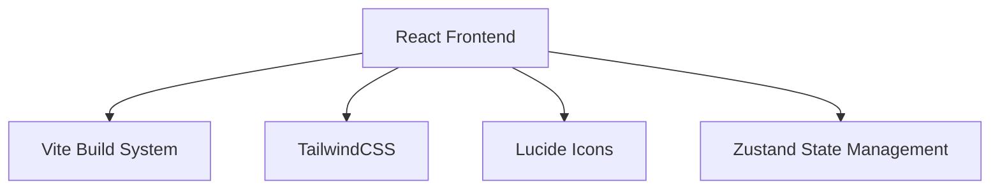

## 1. Architecture Design
纯前端React应用，使用Vite构建，TailwindCSS样式，包含完整的PPT展示功能。



## 2. Technology Description
- Frontend: React@18 + TypeScript + tailwindcss@3 + Vite
- Initialization Tool: vite-init
- Backend: None
- Database: None (静态数据展示)
- State Management: Zustand

## 3. Route Definitions
| Route | Purpose |
|-------|---------|
| / | 封面页，展示项目标题和简介 |
| /industry | 行业分类页，展示各新能源行业 |
| /process | 工序分析页，展示各行业生产工序 |
| /tools | 工具分类页，展示电动工具分类 |
| /summary | 数据总结页，展示行业趋势分析 |

## 4. Data Structure
### 4.1 Industry Data
```typescript
interface Industry {
  id: string;
  name: string;
  description: string;
  icon: string;
  processes: Process[];
}
```

### 4.2 Process Data
```typescript
interface Process {
  id: string;
  name: string;
  description: string;
  tools: string[];
}
```

### 4.3 Tool Data
```typescript
interface Tool {
  id: string;
  name: string;
  category: string;
  isCordless: boolean;
  description: string;
  image: string;
}
```
